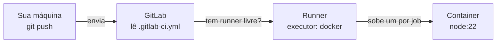
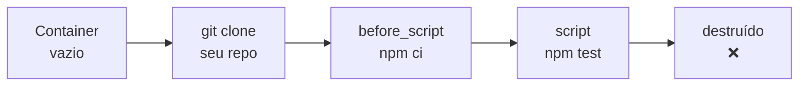
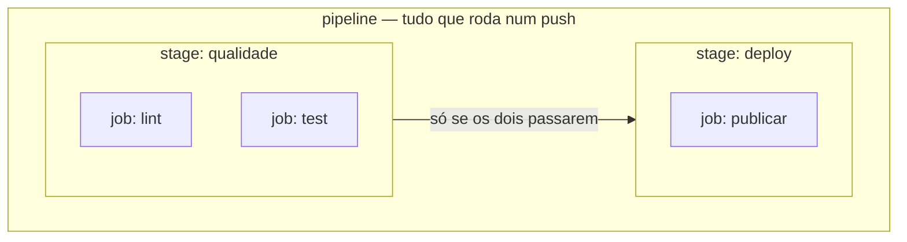
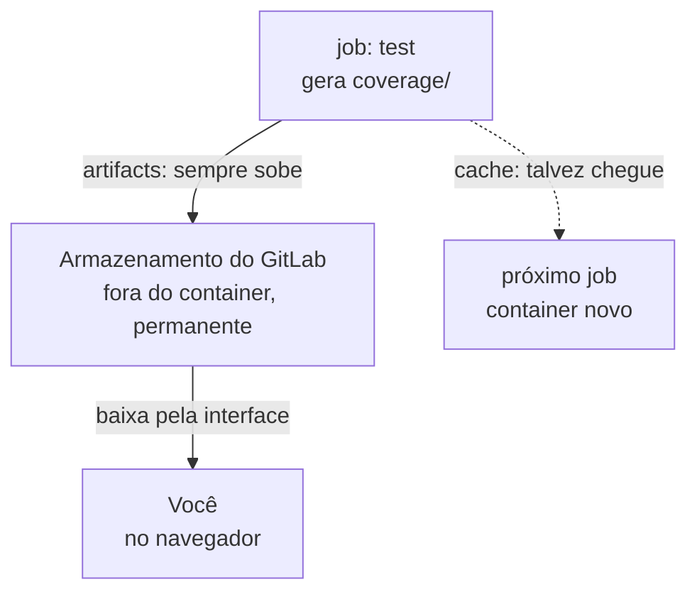

# Guia da Pipeline de CI/CD

Documento de estudo sobre a pipeline do LevelUp English API. Explica o que cada
peça faz e **por quê**, não só o que digitar.

## Sumário

1. [CI e CD: o que é cada um](#1-ci-e-cd-o-que-é-cada-um)
2. [As três peças](#2-as-três-peças)
3. [A regra que explica todo o resto](#3-a-regra-que-explica-todo-o-resto)
4. [Vocabulário: job, stage, pipeline](#4-vocabulário-job-stage-pipeline)
5. [Como o GitLab decide se passou](#5-como-o-gitlab-decide-se-passou)
6. [Construindo em camadas](#6-construindo-em-camadas)
7. [Cache e artifacts](#7-cache-e-artifacts)
8. [Variáveis e segredos](#8-variáveis-e-segredos)
9. [O lado CD: deploy](#9-o-lado-cd-deploy)
10. [Referência das palavras-chave](#10-referência-das-palavras-chave)
11. [Quando der errado](#11-quando-der-errado)
12. [O estado atual deste projeto](#12-o-estado-atual-deste-projeto)

---

## 1. CI e CD: o que é cada um

São duas ideias diferentes que viraram uma sigla só.

**CI — Continuous Integration (Integração Contínua).**
A cada push, uma máquina neutra baixa seu código do zero e verifica se ele ainda
funciona: instala as dependências, roda o lint, roda os testes. O objetivo é
achar o problema em minutos, não na véspera da entrega.

O nome vem do problema que resolve: quando cada pessoa fica dias com o código na
própria máquina, o merge no fim vira um desastre. "Integração contínua" é
integrar cedo e sempre, com uma máquina conferindo cada integração.

**CD — pode ser duas coisas:**

- **Continuous Delivery (Entrega Contínua)** — o código passa por todas as
  verificações e fica *pronto* para ir pra produção, mas alguém aperta o botão.
- **Continuous Deployment (Implantação Contínua)** — passou nas verificações,
  vai pra produção sozinho, sem botão.

A diferença é só quem dá o último passo: uma pessoa ou a máquina.

**Onde este projeto está:** só CI. A pipeline verifica lint e testes. Não existe
deploy automatizado ainda — a [seção 9](#9-o-lado-cd-deploy) explica como seria.

> **Para o TCC:** vale saber a diferença, porque "implementei CI/CD" quando você
> só tem CI é impreciso. "Implementei a pipeline de CI" é exato e igualmente
> respeitável.

---

## 2. As três peças

Quase toda confusão com CI vem de achar que é *uma* coisa. São três, com
trabalhos diferentes.



### O GitLab

Guarda o repositório e lê um arquivo chamado `.gitlab-ci.yml` na raiz.
**Ele não executa nada.** Só olha o arquivo e agenda o trabalho.

### O runner

Um programa instalado num servidor e registrado no seu GitLab. Quando você dá
push, o GitLab pergunta "algum runner livre?" e entrega o trabalho.

> ⚠️ **Se não existir nenhum runner registrado, sua pipeline fica em `pending`
> para sempre.** Isso não é erro do seu YAML e nenhuma mudança no arquivo
> resolve. Confira em **Settings → CI/CD → Runners**.

### O executor

É *como* o runner roda o trabalho. O mais comum é o `docker`: para cada job, ele
sobe um container novo e limpo, clona seu repositório dentro dele, roda seus
comandos e joga o container fora.

Existem outros (`shell`, que roda direto na máquina do runner; `kubernetes`, que
sobe um pod). O `docker` é o padrão porque garante que todo job comece igual.

---

## 3. A regra que explica todo o resto

> **Cada job começa do zero, numa máquina virgem, e nada sobrevive ao fim dele.**



Sem `node_modules`. Sem nada que o job anterior instalou. Sem o `.env` da sua
máquina. Sem o binário do Mongo que você já baixou.

Essa única regra explica:

| Por que... | Porque... |
|---|---|
| todo job precisa de `npm ci` | o `node_modules` morreu com o container anterior |
| existe `cache` | é o jeito de acelerar a reinstalação |
| existe `artifacts` | é o jeito de salvar um resultado antes do container morrer |
| segredos vêm de variáveis | seu `.env` local não existe lá dentro |
| `npm run fix` no CI é inútil | as correções morrem junto com o container |

Guarde essa frase. Se ela fizer sentido, o resto do arquivo se explica sozinho.

---

## 4. Vocabulário: job, stage, pipeline

Três palavras encaixadas uma dentro da outra.



- **job** — uma tarefa isolada. Roda no seu próprio container.
- **stage** — um grupo de jobs. Jobs do mesmo stage rodam **em paralelo**; o
  stage seguinte só começa quando todos do anterior passam.
- **pipeline** — o conjunto de todos os stages de um push.

Se você não declarar `stages`, o GitLab usa os padrões: `.pre`, `build`, `test`,
`deploy`, `.post`. Um job sem `stage:` cai em `test`.

**No nosso caso:** `lint` e `test` estão no mesmo stage, então rodam ao mesmo
tempo. É o que queremos — você quer saber dos dois problemas de uma vez, não
descobrir o lint só depois de consertar o teste.

---

## 5. Como o GitLab decide se passou

Ele roda os comandos em ordem e olha o **exit code** de cada um.

- `0` → sucesso, segue pro próximo comando
- qualquer outro → falha, o job para ali e tudo depois **não roda**

Testa na tua máquina para ver acontecendo:

```bash
echo "oi"       ; echo $?    # 0  -> sucesso
ls /nao-existe  ; echo $?    # 1  -> falha
```

É por isso que `npm test` funciona como job sem configuração nenhuma: o Jest sai
com `0` se tudo passou e com `1` se algum teste quebrou. Mesma coisa com o
ESLint. Você não precisa ensinar nada ao GitLab.

**Consequência prática:** um comando que "conserta" em vez de "verificar" sempre
sai com `0`, e o job passa sempre. Veja a pegadinha do `--fix` na
[camada 2](#camada-2--imagem-e-lint).

---

## 6. Construindo em camadas

Cada camada é um commit. Push, olhe a pipeline rodar, entenda o que aquela
camada resolveu. Não pule pro arquivo final — senão você fica com um YAML que
funciona e que não sabe defender.

### Camada 1 — provar que a pipeline existe

```yaml
ola:
  script:
    - echo "a pipeline rodou"
    - node --version
```

Push e vá em **Build → Pipelines**.

`ola` é um nome que você inventou — todo bloco de primeiro nível que não seja
palavra reservada vira um job. `script` é a única chave obrigatória de um job.

### Camada 2 — imagem e lint

```yaml
lint:
  image: node:22
  script:
    - npm ci
    - npx eslint .
```

`image` é a imagem Docker onde o job roda — mesmo conceito do `FROM node:22` do
nosso `Dockerfile`. Usamos `node:22` porque a máquina de desenvolvimento tem
Node v22.13.0, e queremos que o CI reprove o que reprovaria localmente.

**`npm ci`, não `npm install`:** o `ci` apaga o `node_modules` e instala
exatamente o que está no `package-lock.json`, sem nunca atualizar o lock. É
determinístico. O `install` pode resolver versões diferentes e dar um verde que
não se reproduz.

> ⚠️ **Pegadinha do `--fix`**
>
> O `package.json` tem `"fix": "eslint . --fix"`. Se o CI usar `npm run fix`, o
> ESLint **conserta** os arquivos dentro do container e sai com código `0`.
>
> O job passaria sempre, e o container é destruído logo depois levando as
> correções junto (seção 3). Seria um job de lint decorativo.
>
> Por isso usamos `npx eslint .`, sem `--fix`: ele reprova de verdade.

### Camada 3 — testes

```yaml
test:
  image: node:22
  script:
    - npm ci
    - npm test
```

A suíte está verde: **41 suítes, 879 testes**, ~34s local.

**Mas repare no tempo no CI.** Vai ser bem mais lento, e o log mostra um download
de ~100 MB no meio. Esse download é o `mongodb-memory-server`. Veja
`src/tests/setup/testDatabase.js`:

```js
mongoServer = await MongoMemoryServer.create();
```

Ele não conecta num Mongo de verdade — **baixa um binário do MongoDB** e sobe um
processo em memória. Localmente fica cacheado e você nem percebe. No CI,
container novo = download novo, toda vez. A camada 5 resolve.

### Camada 4 — tirar a duplicação

```yaml
default:
  image: node:22
  before_script:
    - npm ci

lint:
  script:
    - npx eslint .

test:
  script:
    - npm test
```

`default` define o que vale para todo job que não sobrescrever.
`before_script` roda antes do `script` de cada job — é o mesmo que colar aqueles
comandos no topo de cada `script`, só que escrito uma vez.

Para deixar o paralelismo explícito (opcional, mas documenta a intenção):

```yaml
stages:
  - qualidade

lint:
  stage: qualidade
  script:
    - npx eslint .

test:
  stage: qualidade
  script:
    - npm test
```

### Camada 5 — cache

```yaml
variables:
  MONGOMS_DOWNLOAD_DIR: "$CI_PROJECT_DIR/.cache/mongodb-binaries"

default:
  image: node:22
  before_script:
    - npm ci --cache .npm --prefer-offline
  cache:
    key:
      files:
        - package-lock.json
    paths:
      - .npm/
      - .cache/mongodb-binaries/
```

**`MONGOMS_DOWNLOAD_DIR` não é otimização, é requisito.** O default do
`mongodb-memory-server` é guardar em `node_modules/.cache/`. E o `npm ci` apaga
o `node_modules` inteiro antes de instalar. O binário seria descartado no começo
de todo job, com cache ou sem. Precisa sair de dentro do `node_modules`.

`$CI_PROJECT_DIR` é uma variável que o GitLab injeta sozinho, apontando pro
diretório onde ele clonou o repo.

**`cache.paths`** só funciona com caminhos **dentro do projeto** — por isso o
`--cache .npm`, que redireciona o cache do npm (normalmente em `~/.npm`, fora do
projeto) para dentro dele.

**`cache.key`** decide quando reaproveitar:

```
package-lock.json inalterado  ->  mesma chave  ->  reaproveita
instalou pacote novo          ->  chave nova   ->  cache do zero
```

O cache se invalida sozinho quando as dependências mudam.

> A **primeira** pipeline depois dessa mudança ainda é lenta — ela está
> *populando* o cache. A segunda é onde você vê a diferença.

### Camada 6 — coverage e artifacts

```yaml
test:
  stage: qualidade
  script:
    - npm test
  coverage: '/All files\s*\|\s*([\d.]+)/'
  artifacts:
    when: always
    paths:
      - coverage/
    expire_in: 1 week
```

**`coverage`** é uma regex aplicada na saída de texto do job. O grupo de captura
vira o número de cobertura do projeto — aparece na MR e no badge do README.
O `npm test` já roda `jest --coverage`, que imprime:

```
All files                   |   99.73 |    98.66 |     100 |   99.72 |
                              ^^^^^^^ a regex pesca este número
```

**`when: always`** importa: o default é `on_success`, e o artefato que você mais
vai querer olhar é justamente o do job que **falhou**.

### Camada 7 — a pipeline duplicada

Assim que abrir uma MR, você verá **duas pipelines por push** — uma da branch,
uma da MR. É o pegadinha mais clássico do GitLab CI.

```yaml
workflow:
  rules:
    - if: $CI_PIPELINE_SOURCE == "merge_request_event"
    - if: $CI_COMMIT_BRANCH == "main"
    - if: $CI_COMMIT_BRANCH && $CI_OPEN_MERGE_REQUESTS == null
```

`workflow` decide se a **pipeline inteira** roda — diferente de `rules` dentro
de um job, que decide sobre um job só. As regras são lidas de cima para baixo e
a primeira que bater vence:

1. É evento de MR? Roda.
2. É a `main`? Roda.
3. É branch **sem** MR aberta? Roda.

O caso que sobra — branch *com* MR aberta — não bate em nenhuma, então não roda.
Resultado: uma pipeline por push, sempre.

---

## 7. Cache e artifacts

São os dois únicos jeitos de algo atravessar a fronteira do container. E são
opostos.



| | `cache` | `artifacts` |
|---|---|---|
| Para quê | acelerar o job | guardar o resultado |
| Garantido? | **não** | **sim** |
| Você baixa pela interface? | não | sim |
| Passa pro próximo stage? | não confiavelmente | sim, automático |
| Some sem avisar? | pode | só quando expira |

> **Regra para internalizar:** cache é otimização, não garantia. O runner pode
> perder, o cache pode expirar, você pode cair num runner que não tem. **Sua
> pipeline tem que funcionar com o cache vazio** — só mais devagar. Nunca guarde
> em cache algo de que o job precisa para estar *correto*.

---

## 8. Variáveis e segredos

O `.env` está no `.gitignore` e no `.dockerignore` — ou seja, ele **não existe**
dentro do container do CI. Então de onde vêm `JWT_SECRET_ACCESS_TOKEN`,
`EMAIL_PASS` e companhia?

De três lugares, em ordem de precedência (o de baixo ganha):

1. **Variáveis predefinidas do GitLab** — `$CI_PROJECT_DIR`, `$CI_COMMIT_BRANCH`,
   `$CI_PIPELINE_SOURCE`, `$CI_COMMIT_SHA`. Injetadas automaticamente.
2. **`variables:` no `.gitlab-ci.yml`** — para valores não-secretos, que podem
   estar no Git. Ex.: `MONGOMS_DOWNLOAD_DIR`.
3. **Settings → CI/CD → Variables** — a interface do GitLab. É **aqui** que vão
   os segredos. Ficam fora do repositório.

Duas opções na interface que importam:

- **Masked** — o valor vira `[MASKED]` nos logs. Sempre marque para segredos, ou
  um `echo` acidental vaza a senha no log público do job.
- **Protected** — a variável só é exposta em branches/tags protegidas
  (normalmente `main`). Impede que alguém abra uma MR de uma branch qualquer com
  um `script` que imprime a credencial de produção.

> **Neste projeto os testes não precisam disso.** O `jest.setup.js` já define
> fallbacks (`process.env.JWT_SECRET_ACCESS_TOKEN || "test-access-token-secret"`)
> e força `DISABLED_EMAIL=true`. A suíte roda sem nenhuma variável configurada.
> Isso é bom design de teste e é por isso que a pipeline funciona "de graça".

---

## 9. O lado CD: deploy

Este projeto ainda não tem. Mas como já existe `Dockerfile` e
`docker-compose.yml`, o caminho natural é publicar uma imagem.

```yaml
stages:
  - qualidade
  - build
  - deploy

build-imagem:
  stage: build
  image: docker:27
  services:
    - docker:27-dind          # Docker rodando dentro do container
  script:
    - docker build -t $CI_REGISTRY_IMAGE:$CI_COMMIT_SHA .
    - docker push $CI_REGISTRY_IMAGE:$CI_COMMIT_SHA
  rules:
    - if: $CI_COMMIT_BRANCH == "main"

deploy-producao:
  stage: deploy
  script:
    - ./scripts/deploy.sh
  environment:
    name: producao
    url: https://levelup.exemplo.br
  when: manual                # <- botão, em vez de automático
  rules:
    - if: $CI_COMMIT_BRANCH == "main"
```

Peças novas aqui:

- **`services:`** sobe containers auxiliares ao lado do job. `docker:dind`
  (Docker-in-Docker) é necessário para construir imagem dentro de um container.
- **`$CI_REGISTRY_IMAGE`** é o registry de imagens embutido no seu GitLab. Você
  não precisa de Docker Hub.
- **`environment:`** registra no GitLab que este job publica em "produção". Cria
  a aba **Deployments**, com histórico e botão de rollback.
- **`when: manual`** transforma o job num botão. É exatamente a fronteira entre
  *Continuous Delivery* e *Continuous Deployment*: com o botão é delivery, sem
  ele é deployment.
- **`rules:`** aqui limita o job à `main` — você não quer que toda branch faça
  deploy.

**Ordem importa:** `deploy` só roda depois de `build`, que só roda depois de
`qualidade`. Se um teste quebrar, nada é publicado. Esse encadeamento é o valor
central de ter CI antes de ter CD.

---

## 10. Referência das palavras-chave

| Chave | Onde vai | O que faz |
|---|---|---|
| `stages` | topo | Declara a ordem dos grupos de jobs |
| `default` | topo | Valores herdados por todos os jobs |
| `workflow` | topo | Decide se a **pipeline inteira** roda |
| `variables` | topo ou job | Variáveis de ambiente |
| `include` | topo | Importa YAML de outro arquivo ou repo |
| `image` | job/default | Imagem Docker onde o job roda |
| `services` | job/default | Containers auxiliares (banco, dind) |
| `before_script` | job/default | Comandos antes do `script` |
| `script` | job | **Obrigatório.** Os comandos do job |
| `after_script` | job/default | Roda mesmo se o job falhar (limpeza) |
| `stage` | job | Em qual stage o job entra |
| `cache` | job/default | Diretórios reaproveitados entre jobs |
| `artifacts` | job | Arquivos salvos no GitLab |
| `coverage` | job | Regex que extrai o % da saída |
| `rules` | job | Decide se **este job** roda |
| `when` | job | `on_success` (padrão), `always`, `manual`, `never` |
| `needs` | job | Roda assim que os jobs listados terminarem, furando a ordem dos stages |
| `environment` | job | Marca o job como deploy num ambiente |
| `allow_failure` | job | Job pode falhar sem reprovar a pipeline |
| `timeout` | job | Tempo máximo antes de matar o job |
| `retry` | job | Quantas vezes tentar de novo se falhar |

---

## 11. Quando der errado

| Sintoma | Causa mais provável | Onde olhar |
|---|---|---|
| `pending` eterno | Nenhum runner disponível | Settings → CI/CD → Runners. Não adianta mexer no YAML |
| Erro de sintaxe | Indentação ou chave inválida | CI/CD → Editor → Lint (valida sem push) |
| Passa local, falha no CI | Variável que só existe no seu `.env` | Settings → CI/CD → Variables |
| Job `test` falha no download | Runner sem saída pra internet | `mongodb-memory-server` baixa de `fastdl.mongodb.org` em runtime |
| Job morre com código **137** | OOM kill (falta de memória) | Cada teste sobe um `mongod`; o Jest paraleliza em `CPUs − 1`. Use `npm test -- --maxWorkers=2` |
| Erro que a sua máquina não mostra | `npm install` local escondeu com pacote velho | O CI usa `npm ci`, que apaga tudo. Às vezes acha problema real |
| Lint nunca reprova | Usou `--fix` no CI | Seção 6, camada 2 |

**Como ler um job que falhou:** procure a **primeira** linha vermelha, não a
última — o resto costuma ser consequência. E lembre que o job para no primeiro
comando com exit code diferente de zero, então tudo depois dele não rodou.

---

## 12. O estado atual deste projeto

O `.gitlab-ci.yml` de hoje:

```yaml
default:
  image: node:22
  before_script:
    - npm ci

lint:
  script:
    - npx eslint .

test:
  script:
    - npm test
```

Isso é uma pipeline legítima e completa para o que precisa fazer. Ela instala,
linta e testa em containers limpos, e reprova de verdade quando algo quebra.

**O que falta é conforto, não correção:**

| Melhoria | Ganho | Camada |
|---|---|---|
| `cache` + `MONGOMS_DOWNLOAD_DIR` | Deixa de rebaixar ~100 MB por pipeline | 5 |
| `coverage` | Badge e % na MR | 6 |
| `artifacts` | Baixar o relatório HTML de cobertura | 6 |
| `workflow.rules` | Uma pipeline por push, não duas | 7 |
| `stages` explícito | Documenta a intenção | 4 |

Adicione uma por vez, com um commit cada, observando o efeito. É mais fácil
entender o `cache` depois de sentir a pipeline lenta.
